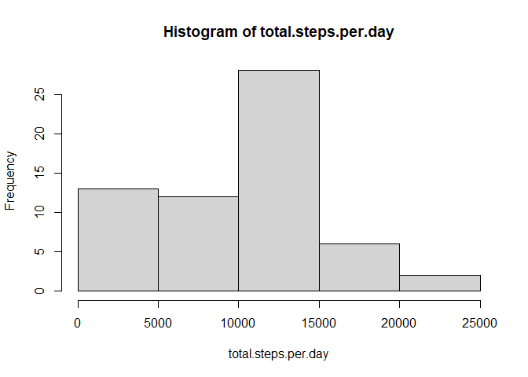
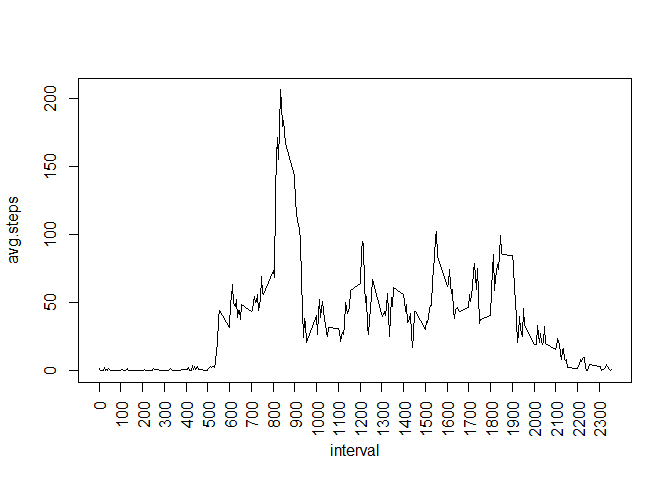
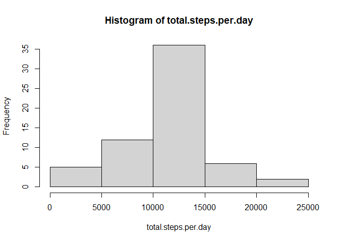
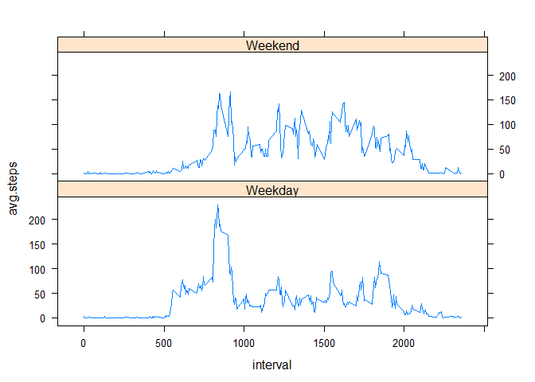

## Loading and preprocessing the data

```r
# unzip and read raw data
unzip("activity.zip")
df <- read.csv("activity.csv")

# Convert date format
df$date <- as.Date(df$date, format = "%Y-%m-%d")
```


## What is mean total number of steps taken per day?

1. Total number of steps taken per day

```r
df %>% group_by(date) %>% 
        summarise(total.steps.per.day = sum(steps, na.rm = TRUE)) %>% 
        print(n=100)
```

```
## `summarise()` ungrouping output (override with `.groups` argument)
```

```
## # A tibble: 61 x 2
##    date       total.steps.per.day
##    <date>                   <int>
##  1 2012-10-01                   0
##  2 2012-10-02                 126
##  3 2012-10-03               11352
##  4 2012-10-04               12116
##  5 2012-10-05               13294
##  6 2012-10-06               15420
##  7 2012-10-07               11015
##  8 2012-10-08                   0
##  9 2012-10-09               12811
## 10 2012-10-10                9900
## 11 2012-10-11               10304
## 12 2012-10-12               17382
## 13 2012-10-13               12426
## 14 2012-10-14               15098
## 15 2012-10-15               10139
## 16 2012-10-16               15084
## 17 2012-10-17               13452
## 18 2012-10-18               10056
## 19 2012-10-19               11829
## 20 2012-10-20               10395
## 21 2012-10-21                8821
## 22 2012-10-22               13460
## 23 2012-10-23                8918
## 24 2012-10-24                8355
## 25 2012-10-25                2492
## 26 2012-10-26                6778
## 27 2012-10-27               10119
## 28 2012-10-28               11458
## 29 2012-10-29                5018
## 30 2012-10-30                9819
## 31 2012-10-31               15414
## 32 2012-11-01                   0
## 33 2012-11-02               10600
## 34 2012-11-03               10571
## 35 2012-11-04                   0
## 36 2012-11-05               10439
## 37 2012-11-06                8334
## 38 2012-11-07               12883
## 39 2012-11-08                3219
## 40 2012-11-09                   0
## 41 2012-11-10                   0
## 42 2012-11-11               12608
## 43 2012-11-12               10765
## 44 2012-11-13                7336
## 45 2012-11-14                   0
## 46 2012-11-15                  41
## 47 2012-11-16                5441
## 48 2012-11-17               14339
## 49 2012-11-18               15110
## 50 2012-11-19                8841
## 51 2012-11-20                4472
## 52 2012-11-21               12787
## 53 2012-11-22               20427
## 54 2012-11-23               21194
## 55 2012-11-24               14478
## 56 2012-11-25               11834
## 57 2012-11-26               11162
## 58 2012-11-27               13646
## 59 2012-11-28               10183
## 60 2012-11-29                7047
## 61 2012-11-30                   0
```

2. Histogram of the total number of steps taken per day

```r
df %>% group_by(date) %>% 
        summarise(total.steps.per.day = sum(steps, na.rm = TRUE)) %>% 
        with(hist(total.steps.per.day))
```

```
## `summarise()` ungrouping output (override with `.groups` argument)
```

<!-- -->

3. Mean and median of the total number of steps taken per day

```r
mean.steps <- df %>% group_by(date) %>% 
        summarise(total.steps.per.day = sum(steps, na.rm = TRUE)) %>%
        with(mean(total.steps.per.day))
```

```
## `summarise()` ungrouping output (override with `.groups` argument)
```

```r
print(paste("Mean of total number of steps taken per day is", round(mean.steps, 2)))
```

```
## [1] "Mean of total number of steps taken per day is 9354.23"
```


```r
median.steps <- df %>% group_by(date) %>% 
        summarise(total.steps.per.day = sum(steps, na.rm = TRUE)) %>% 
        with(median(total.steps.per.day))
```

```
## `summarise()` ungrouping output (override with `.groups` argument)
```

```r
print(paste("Median of total number of steps taken per day is", round(median.steps, 2)))
```

```
## [1] "Median of total number of steps taken per day is 10395"
```

## What is the average daily activity pattern?
1. Time series plot of avg steps across all day vs 5-min interval 

```r
# group by interval and average across days within dataset
df %>% group_by(interval) %>% 
    summarise(avg.steps=mean(steps, na.rm = TRUE)) %>% 
    with(plot(interval, avg.steps, type="l", xaxt="n"))
```

```
## `summarise()` ungrouping output (override with `.groups` argument)
```

```r
axis(1, at = seq(0, 2335, by=100), las=2)
```

<!-- -->

2. Maximum number of steps within 5-min interval across all days in dataset

```r
df.avg.steps.per.interval <- df %>% group_by(interval) %>% 
        summarise(avg.steps=mean(steps, na.rm = TRUE))
```

```
## `summarise()` ungrouping output (override with `.groups` argument)
```

```r
# get the rows for the maximum steps
max.steps <- df.avg.steps.per.interval[
        which.max(df.avg.steps.per.interval$avg.steps),
        ]

max.interval <- max.steps[1]
max.steps <- max.steps[2]

print(paste("The maximum steps within 5-min interval is", max.steps, "happened at interval", max.interval))
```

```
## [1] "The maximum steps within 5-min interval is 206.169811320755 happened at interval 835"
```

## Imputing missing values
1. Total number of missing values in the dataset

```r
colSums(is.na(df))
```

```
##    steps     date interval 
##     2304        0        0
```

2. Create and Impute missing values in the dataset

```r
## impute missing value with it's average steps across days for that interval

# Get the index for all missing steps in df interval matching with 
# aggregated avg steps for each interval
cond <- match(df$interval[is.na(df$steps)], df.avg.steps.per.interval$interval)

impute.df <- df %>% 
        mutate(steps = ifelse(is.na(steps),
                                     df.avg.steps.per.interval$avg.steps[cond],
                                     steps))
```

3. Make a histogram and calculate the mean and median total number of steps
taken per day.

```r
impute.df %>% group_by(date) %>% 
        summarise(total.steps.per.day = sum(steps, na.rm = TRUE)) %>% 
        with(hist(total.steps.per.day))
```

```
## `summarise()` ungrouping output (override with `.groups` argument)
```

<!-- -->


The mean and median for impute missing value datasets

```r
impute.mean.steps <- impute.df %>% group_by(date) %>% 
        summarise(total.steps.per.day = sum(steps, na.rm = TRUE)) %>%
        with(mean(total.steps.per.day))
```

```
## `summarise()` ungrouping output (override with `.groups` argument)
```

```r
impute.median.steps <- impute.df %>% group_by(date) %>% 
        summarise(total.steps.per.day = sum(steps, na.rm = TRUE)) %>% 
        with(median(total.steps.per.day))
```

```
## `summarise()` ungrouping output (override with `.groups` argument)
```

```r
print(paste("Latest mean of total number of steps taken per day is", 
            round(impute.mean.steps, 2)))
```

```
## [1] "Latest mean of total number of steps taken per day is 10766.19"
```

```r
print(paste("Latest median of total number of steps taken per day is", 
            round(impute.median.steps, 2)))
```

```
## [1] "Latest median of total number of steps taken per day is 10766.19"
```

Both the mean and median for total daily number of steps increased for imputed
missing values dataset.

Missing values previously being replaced cause an increased in steps data. 
Other than increased in mean and median, the previously left skewed histogram 
for total daily number of steps also because more normal.

## Are there differences in activity patterns between weekdays and weekends?

1. Create new variable with "weekday" and "weekend"

```r
impute.df$Week <- factor(ifelse(
        weekdays(impute.df$date) %in% c("Saturday", "Sunday"), 
        "Weekend", 
        "Weekday"))
```

2. Panel plot for avg number of steps taken vs 5-min interval for weekday and
weekend

```r
impute.df.Week <- impute.df %>% group_by(interval, Week) %>% 
    summarise(avg.steps=mean(steps, na.rm = TRUE))
```

```
## `summarise()` regrouping output by 'interval' (override with `.groups` argument)
```

```r
xyplot(avg.steps ~ interval | Week, 
       data = impute.df.Week, 
       type='l', 
       layout=c(1,2))
```

<!-- -->
